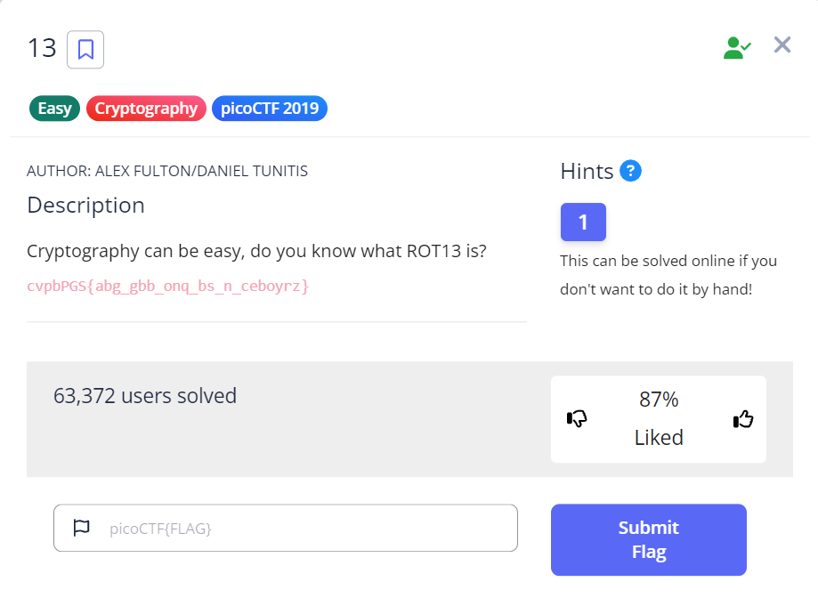
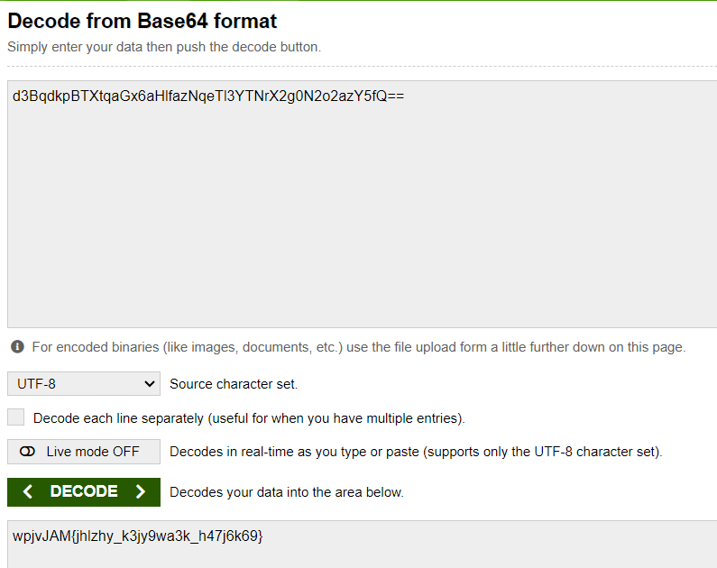

# PicoCTF Write-Up ( Cryptography )

<!--
PicoCTF 2019
PicoCTF 2021
PicoCTF 2024
-->

[**PicoCTF 2019**](#PicoCTF-2019)
- [**The Numbers**](#the-numbers)
- [**13**](#13)

[**PicoCTF 2021**](#PicoCTF-2021)
- [**Mod 26**](#mod-26)

[**PicoCTF 2024**](#PicoCTF-2024)
- [**interencdec**](#interencdec)

## PicoCTF 2019
- ### The Numbers

On this simple task we've been given a picture that ahve numbers in it, probably a flag

Identified those number is [Letter Number Code (A1Z26)](hhttps://www.codewars.com/kata/5e83519136b284002487e3f9). 

Go to [Dcode.fr](https://www.dcode.fr/letter-number-cipher) to decode the message, then you'll get the flag

``PICOCTF{THENUMBERSMASON}``

- ### 13

As the Description shown we know that its ROT 13 Cipher.

This one similar to recent 3108 CTF Events which is [``Perak : Pandak Lam``](https://github.com/Amca-qt/3108-CTF-WriteUp?tab=readme-ov-file#perak--pandak-lam-)

``picoCTF{not_too_bad_of_a_problem}``

## PicoCTF 2021
- ### Mod 26

This one also a similar to [Challenge 13](https://github.com/Amca-qt/PicoCTF-WriteUp/blob/main/Challenges/Cryptography/README.md#13)

``picoCTF{next_time_I'll_try_2_rounds_of_rot13_ZNMldSDw}``

## PicoCTF 2024
- ### interencdec

This task provide us with a file named ``enc_flag``, which is contain a base64 Encoded text

Decode the text, then you'll get another base64 Encoded strings

``wpjvJAM{jhlzhy_k3jy9wa3k_h47j6k69}``
> ROT 13 Cipher

Decode the Cipher using Dcode.fr, then you'll get the flag

``picoCTF{caesar_d3cr9pt3d_a47c6d69}``