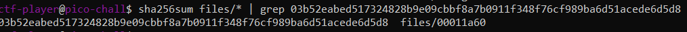

# PicoCTF Write Up ( Forensics )


<!--
PicoCTF 2019
PicoCTF 2021
PicoCTF 2023
PicoCTF 2024
-->

[**PicoCTF 2019**](#PicoCTF-2019)
- [**Glory Of The Garden**](#glory-of-the-garden)

[**PicoCTF 2021**](#PicoCTF-2021)
- [**information**](#information)

[**PicoCTF 2023**](#PicoCTF-2023)
- [**FindAndOpen**](#findandopen)

[**PicoCTF 2024**](#PicoCTF-2024)
- [**Verify**](#verify)
- [**Scan Surprise**](#scan-surprise)
- [**Secret Of the Polyglot**](#secret-of-the-polyglot)
- [**CanYouSee**](#canyousee)
- [**Mob psycho**](#mob-psycho)

## PicoCTF 2019
- ### Glory Of The Garden

This task provide us with a [picture](https://jupiter.challenges.picoctf.org/static/43c4743b3946f427e883f6b286f47467/garden.jpg) named garden.jpg.

before we get to solution, lets get to know what is [HEX/Hexadecimal](https://en.wikipedia.org/wiki/Hexadecimal#:~:text=In%20mathematics%20and%20computing%2C%20the,represented%20by%20two%20hexadecimal%20digits.)

Hex ( short for <strong>Hexadecimal</strong> ) is a numbering system that uses 16 symbols: 0-9 and A-F, where: 
> - 0-9 represent values 0 to 9.
> - A-F represent values 10 to 15.

Hex is often used in computing because it's a compact way to represent binary data (the 0s and 1s that computers use).

Now the solution, it looks like normal Picture with a garden scenery, but lets take a look with [HexEd.it](https://hexed.it), upload it on the site, then scroll down you will get the flag
> **Note**. You can use [strings command](https://www.sciencedirect.com/topics/computer-science/string-command#:~:text=The%20strings%20command%20on%20a,file%2C%20text%2C%20or%20binary.) to looks for printable strings in a file. 

```picoCTF{more_than_m33ts_the_3y3657BaB2C}```

## PicoCTF 2021
- ### information

On this task we've been given a picture named [cat.jpg](https://mercury.picoctf.net/static/b4d62f6e431dc8e563309ea8c33a06b3/cat.jpg) with the description ``Files can always be changed in a secret way. Can you find the flag?``

There's a various way to view an image details, one of it is [exiftool](https://exiftool.org/examples.html)

Power up your terminal, run the exiftool command ``exiftool cat.jpg``, you'll see the modified metadata extracted by exiftool. you'll see ``Copyright Notice : PicoCTF`` and base64 encoded license under the XMP Toolkit ``License : cGljb0NURnt0aGVfbTN0YWRhdGFfMXNfbW9kaWZpZWR9`` 

Here's the difference between Modified Metadata and Unmodified Metadata :

> Modified Metadata 

```
ExifTool Version Number         : 12.67
File Name                       : cat.jpg
Directory                       : .
File Size                       : 878 kB
File Modification Date/Time     : 2021:03:16 02:24:46+08:00
File Access Date/Time           : 2024:10:15 09:38:15+08:00
File Inode Change Date/Time     : 2024:09:04 17:42:11+08:00
File Permissions                : -rwxrwxrwx
File Type                       : JPEG
File Type Extension             : jpg
MIME Type                       : image/jpeg
JFIF Version                    : 1.02
Resolution Unit                 : None
X Resolution                    : 1
Y Resolution                    : 1
Current IPTC Digest             : 7a78f3d9cfb1ce42ab5a3aa30573d617
Copyright Notice                : PicoCTF
Application Record Version      : 4
XMP Toolkit                     : Image::ExifTool 10.80
License                         : cGljb0NURnt0aGVfbTN0YWRhdGFfMXNfbW9kaWZpZWR9
Rights                          : PicoCTF
Image Width                     : 2560
Image Height                    : 1598
Encoding Process                : Baseline DCT, Huffman coding
Bits Per Sample                 : 8
Color Components                : 3
Y Cb Cr Sub Sampling            : YCbCr4:2:0 (2 2)
Image Size                      : 2560x1598
Megapixels                      : 4.1
```

> Unmodified Metadata

```
ExifTool Version Number         : 12.67
File Name                       : rimuru.jpg
Directory                       : .
File Size                       : 105 kB
File Modification Date/Time     : 2024:10:15 09:43:29+08:00
File Access Date/Time           : 2024:10:15 09:43:37+08:00
File Inode Change Date/Time     : 2024:10:15 09:43:29+08:00
File Permissions                : -rwxrwxrwx
File Type                       : JPEG
File Type Extension             : jpg
MIME Type                       : image/jpeg
JFIF Version                    : 1.01
Resolution Unit                 : inches
X Resolution                    : 72
Y Resolution                    : 72
Current IPTC Digest             : d41d8cd98f00b204e9800998ecf8427e
IPTC Digest                     : d41d8cd98f00b204e9800998ecf8427e
Image Width                     : 736
Image Height                    : 736
Encoding Process                : Progressive DCT, Huffman coding
Bits Per Sample                 : 8
Color Components                : 3
Y Cb Cr Sub Sampling            : YCbCr4:2:0 (2 2)
Image Size                      : 736x736
Megapixels                      : 0.542
```

You can see the file Modification,Access,Inode change Date/Time between the two different image

Decode the license strings, then you'll get the flag 

``picoCTF{the_m3tadata_1s_modified}``

## PicoCTF 2023
- ### FindAndOpen

This task provide us with ``.pcap`` file and password protected compressed file named ``flag.zip`` 

FYI : 
> A **PCAP file** (Packet Capture) is a file format that stores network data that has been captured during communication between devices. It’s like a recording of all the data (packets) that travel across a network.

**What it does** : 
- It captures network traffic (like conversations between computers), including things like browsing the web, sending emails, or any other data sent across the network.

**Why it's useful** : 
- PCAP files are mainly used by network administrators or security experts to analyze network issues, troubleshoot, or investigate suspicious activity (like hacking attempts).

**Example** : 

if you're analyzing a PCAP file, ypu might see :

- **IP addresses** : Showing who's talking to whom
- **Protocols** : Like HTTP, TCP, or DNS, indicating the type of data.
- **Content** : The actual data being sent (like text from a web page).

Open the .pcap file with wireshark you can see the ``Protocol : 0x6865`` with a Content ``Flying on Ethernet secret: Is this the flag``

We got a bunch of Clue here 

<!-- VGhpcyBpcyB0aGUgc2VjcmV0OiBwaWNvQ1RGe1IzNERJTkdfTE9LZF8= -->

```
1. iBwaWNvQ1RGe1 Could the flag have been splitted?

2. AABBHHPJGTFRLKVGhpcyBpcyB0aGUgc2VjcmV0OiBwaWNvQ1RGe1IzNERJTkdfTE9LZF8=

3. PBwaWUvQ1RGesabababkjaASKBKSBACVVAVSDDSSSSDSKJBJS

4. PBwaWUvQ1RGe1 Maybe try checking the other file
```

Notice it's Base64 Encoded , combine those clue to then Decode it, you'll get part of the flag

``PBwaWUvQ1RGesabababkjaASKBKSBACVVAVSDDSSSSDSKJBJSiBwaWNvQ1RGe1AABBHHPJGTFRLKVGhpcyBpcyB0aGUgc2VjcmV0OiBwaWNvQ1RGe1IzNERJTkdfTE9LZF8``
> picoCTF{R34DING_LOKd_

Remember the 1st and 4th clue, check the compressed zip file , and enter the part of flag, you'll get another file named ``flag``

view the file using command ``cat flag``

``picoCTF{R34DING_LOKd_fil56_succ3ss_c2e6d949}``

## PicoCTF 2024
- ### Verify

For this task we've been given zip file ``challenge.zip`` and access to ssh for this challenge, also we've been given two crucial information that need to use in this challenge [``checksum``](https://www.comparitech.com/blog/information-security/what-is-checksum/) and ``decrypt.sh``

There is another directory for this challenge ``files`` that have a ton of files.

Do check the checksum.txt

```
ctf-player@pico-chall$ cat checksum.txt
03b52eabed517324828b9e09cbbf8a7b0911f348f76cf989ba6d51acede6d5d8
```
> sha256 hash of the targeted file

from this we have to check files in "files" directory to see which one match

since the file name ``checksum.txt`` i assume we using SHA checksum [``sha256sum``](https://www.computerhope.com/unix/sha256sum.htm) 
> sha256sum files/*


we can use [grep](https://www.geeksforgeeks.org/grep-command-in-unixlinux/) to fasten our job

`` sha256sum files/* | grep 03b52eabed517324828b9e09cbbf8a7b0911f348f76cf989ba6d51acede6d5d8``



> file 00011a60 matched the checksum

use the decrypt file given before, ``./decrypt.sh files/00011a60``, then you'll get the flag

``picoCTF{trust_but_verify_00011a60}``

- ### Scan Surprise

For this task we've been given ``ssh access`` and ``zip file`` contain ``Qr Code image`` named flag.png

Download the zip and extract it, go to directory ``/home/ctf-player/drop-in`` you'll find the Qr Code there. 

Go to [``Qr Code Scanner``](https://dnschecker.org/qr-code-scanner.php), then you'll get the flag

``picoCTF{p33k_@_b00_a81f0a35}``

- ### Secret Of the Polyglot

This task provide us with a ``pdf`` file that need to change to ``png`` file to view image with a part of the flag 


> picoCTF{f1u3n7_

This means we have to find another part of flag

Using ExifTool to view metadata of the image file, we get an interesting Outcome

```
Warning : [minor] Trailer data after PNG IEND chunk
```

This indicates that there is a file embedded after the [IEND chunk](https://medium.com/@0xwan/png-structure-for-beginner-8363ce2a9f73) in the PNG file

from the Exiftool, we know that something hidden after the IEND chunk


From here, we will notice a PDF header signature after the trailer chunk of the PNG. We can crave out the PDF hex of it into a new pdf file

But remember to start from ``25 50 44 46``

Let's create another pdf file using pdf hex on [HexEd.it](https://hexed.it/) save it as flag.pdf, then open it, you'll get another part of the flag


> 1n_pn9_&_pdf_90974127}

``picoCTF{f1u3n7_1n_pn9_&_pdf_90974127}``

- ### CanYouSee

For this simple task, we've been given a picture of great scenery 

the hints said ``How can you view the information about the picture?``

Use Exiftool to view the Metadata of the image and found interesting outcome


the ``Attribution URL`` is Encoded with a Base64, decode it then you'll get the flag

``picoCTF{ME74D47A_HIDD3N_d8c381fd}``

- ### Mob psycho

For this task we've been given .apk file named ``mob_psycho.apk``. Decompile it and unzip the file.

let's use [find command]() to find our flag

``find mobpsycho.apk_Decompiler.com -name "*.txt"``
> **Note** if you using Decompiler.com to decompile your apk, then your directory after extract should be like this

then you'll get directory containing file ``flag.txt``

``mobpsycho.apk_Decompiler.com/resources/res/color/flag.txt``

but its not a normal text file, our flag is in Hex, so lets use Hex to String converter such as [CyberChef](https://gchq.github.io/CyberChef/)


``picoCTF{ax8mC0RU6ve_NX85l4ax8mCl_703dd9ef}``