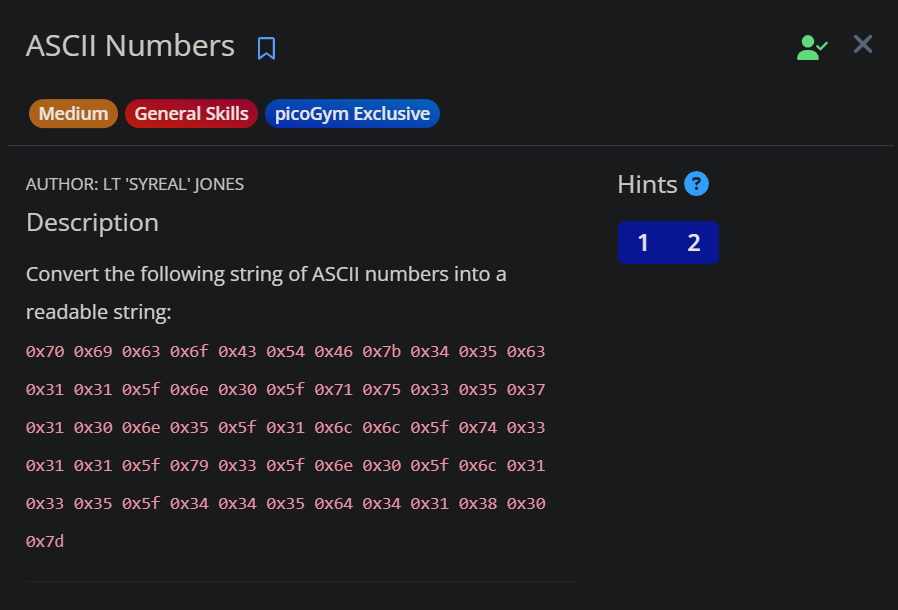
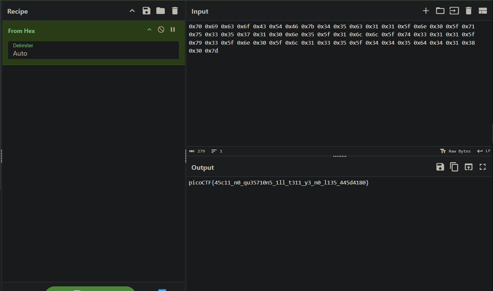

# PicoCTF Write Up ( General Skills )


<!--
picoGym Exclusive
PicoCTF 2021
Beginner picoMini 2022
PicoCTF 2023
PicoCTF 2024
-->

[**picoGym Exclusive**](#picoGym-Exclusive)
- [**Big Zip**](#big-zip)
- [**First Find**](#first-find)
- [**ASCII Numbers**](#ascii-numbers)

[**PicoCTF 2021**](#PicoCTF-2021)
- [**Tab, Tab, Attack**](#tab-tab-attack)

[**Beginner picoMini 2022**](#Beginner-picoMini-2022)
- [**runme.py**](#runme.py)
- [**PW Crack 1**](#pw-crack-1)
- [**PW Crack 2**](#pw-crack-2)
- [**fixme1.py**](#fixme1.py)
- [**fixme2.py**](#fixme2.py)
- [**convertme.py**](#convertme.py)

[**PicoCTF 2023**](#PicoCTF-2023)
- [**repetitions**](#repetitions)

[**PicoCTF 2024**](#PicoCTF-2024)
- [**Time Machine**](#time-machine)
- [**Super SSH**](#super-ssh)
- [**Commitment Issues**](#commitment-issues)

## picoGym Exclusive
- ### Big Zip

On this challenge, we've been given a zip file named `big-zip-files` and it is big. LoL

extract the zip and go to the directory, you'll find a lot directory and text file with a weird name.

the hint mention [`Grep Command`](https://www.geeksforgeeks.org/grep-command-in-unixlinux/#syntax-of-grep-command-in-unixlinux), so we use grep

`grep -rni "pico` and we will get the flag

`picoCTF{gr3p_15_m4g1c_ef8790dc}`

- ### First Find

On this challenge we have to find text file named  `uber-secret.txt`, this challenge is the same like [**Big Zip**](#big-zip), but we use [`Find Command`](https://quickref.me/find.html).
> indeed we can use grep, but why not we use find on this one

with this command , you find a director with a text file named `uber-secret.txt`

`find . -type f -name "*.txt"`


`picoCTF{f1nd_15_f457_ab443fd1}`

- ### ASCII Numbers 

This challenge require us to change a String of ASCII Numbers into readable strings.



the string is hex, just convert it using cyberchef then you'll get the flag



`picoCTF{45c11_n0_qu35710n5_1ll_t311_y3_n0_l135_445d4180}`

## PicoCTF 2021
- ### Tab, Tab, Attack

This chall also look-alike [**Big Zip**](#big-zip) and [**First Find**](#first-find) but instead we have to run thefile and get the flag

```
└─$ ./fang-of-haynekhtnamet
*ZAP!* picoCTF{l3v3l_up!_t4k3_4_r35t!_524e3dc4}
```

## Beginner picoMini 2022
- ### runme.py

As the chall name, just run the python program then you'll get the flag


- ### PW Crack 1

On this challenge we've been given 2 file, one is encrypted flag and one is decrypter written in python, so first lets analyse the code from the decrypter

```
### THIS FUNCTION WILL NOT HELP YOU FIND THE FLAG --LT ########################
def str_xor(secret, key):
    #extend key to secret length
    new_key = key
    i = 0
    while len(new_key) < len(secret):
        new_key = new_key + key[i]
        i = (i + 1) % len(key)
    return "".join([chr(ord(secret_c) ^ ord(new_key_c)) for (secret_c,new_key_c) in zip(secret,new_key)])
###############################################################################


flag_enc = open('level1.flag.txt.enc', 'rb').read()


def level_1_pw_check():
    user_pw = input("Please enter correct password for flag: ")
    if( user_pw == "8713"):
        print("Welcome back... your flag, user:")
        decryption = str_xor(flag_enc.decode(), user_pw)
        print(decryption)
        return
    print("That password is incorrect")


level_1_pw_check()
```

using the password `8713` in the code, will give us the flag

`picoCTF{545h_r1ng1ng_1b2fd683}`

- ### PW Crack 2

This one is the same like `PW Crack 1` but the password is encoded in hex, assemble the hex then use CyberChef to decode the hex

```
user_pw == chr(0x34) + chr(0x65) + chr(0x63) + chr(0x39)

password is = 4ec9
```

`picoCTF{tr45h_51ng1ng_9701e681}`

- ### fixme1.py

As the chall name and the description of the chall we have to fix the syntax to print the flag, the error at last line, remove the indent and you'll get the flag

`picoCTF{1nd3nt1ty_cr1515_6a476c8f}`

- ### fixme2.py

For this challenge we have to fix the [Python Assignment Operators](https://www.w3schools.com/python/python_operators.asp) on line 22

```
From this :

flag = ""

to this :

flag == ""
```

Difference between `=` and `==` is :

`=` is the assignment operator. It assigns a value to a variable.

`==` is the equality operator. It checks if two values are equal and returns `True` or `False`.

So, `=` is used to set a value, while `=`= is used to compare values.

`picoCTF{3qu4l1ty_n0t_4551gnm3nt_f6a5aefc}`

- ### convertme.py

This challenge require us to convert the given number from decimal to binary.

using this [Online Decimal To Binary](https://www.rapidtables.com/convert/number/decimal-to-binary.html)

`picoCTF{4ll_y0ur_b4535_9c3b7d4d}`

## PicoCTF 2023
- ### repetitions

On this challenge, we've been given a file with encrypted flag encoded with base64 Encoded 6 times

`picoCTF{base64_n3st3d_dic0d!n8_d0wnl04d3d_de523f49}`

## PicoCTF 2024
- ### Time Machine

This challenge give us a zip file with a message 

`This is what I was working on, but I'd need to look at my commit history to know why...` and .git directory

using command `git log` will give us the flag

`picoCTF{t1m3m@ch1n3_b476ca06}`

- ### Super SSH

Just connect to the ssh given with this command

`ssh ctf-player@titan.picoctf.net -p <given port>` and enter the password given, then you'll get the flag

`picoCTF{s3cur3_c0nn3ct10n_65a7a106}`

- ### Commitment Issues


This is really simple flag, just open the file message.txt and you'll get the flag

`picoCTF{s@n1t1z3_be3dd3da}`