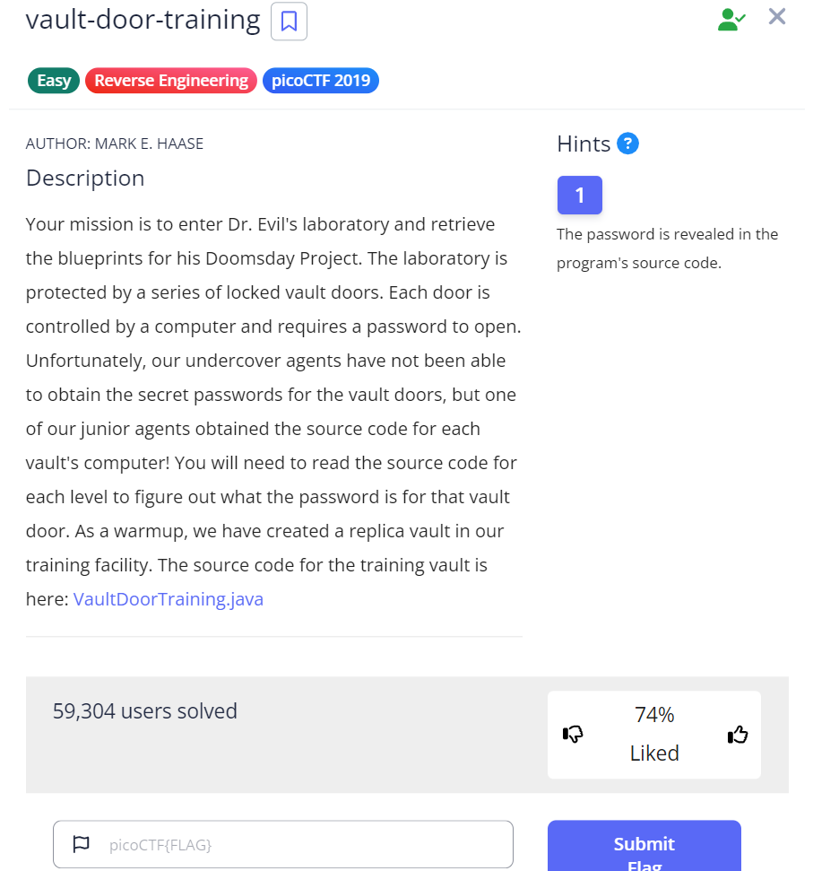

# PicoCTF Write Up ( Reverse Engineering )


<!--
PicoCTF 2019
PicoCTF 2021
PicoCTF 2024
-->

[**PicoCTF 2019**](#PicoCTF-2019)
- [**Vault Door Training**](#vault-door-training)

[**PicoCTF 2021**](#PicoCTF-2021)
- [**Transformation**](#transformation)

[**PicoCTF 2024**](#PicoCTF-2024)
- [**weirdSnake**](#weirdsnake)

## PicoCTF 2019
- ### vault-door-training



For this task, we provided a java file named ``VaultDoorTraining.java`` with a hint ``The password is revealed in the programs source code`` 

lets take a look at the source code 

```
import java.util.*;

class VaultDoorTraining {
    public static void main(String args[]) {
        VaultDoorTraining vaultDoor = new VaultDoorTraining();
        Scanner scanner = new Scanner(System.in); 
        System.out.print("Enter vault password: ");
        String userInput = scanner.next();
	String input = userInput.substring("picoCTF{".length(),userInput.length()-1);
	if (vaultDoor.checkPassword(input)) {
	    System.out.println("Access granted.");
	} else {
	    System.out.println("Access denied!");
	}
   }

    // The password is below. Is it safe to put the password in the source code?
    // What if somebody stole our source code? Then they would know what our
    // password is. Hmm... I will think of some ways to improve the security
    // on the other doors.
    //
    // -Minion #9567
    public boolean checkPassword(String password) {
        return password.equals("w4rm1ng_Up_w1tH_jAv4_eec0716b713");
    }
}
```

**Lets Break it Down :**

### Class Definiton

- ##### The class ``VaultDoorTraining`` contains the logic for the program, representing a training vault door that users are trying to unlock with a password.

### Main Method

- ##### The ``main`` method is the entry point of the program
- ##### Inside ``main``, a new object of ``VaultDoorTraining`` is created (``vaultDoor``)
- ##### A ``Scanner`` object is used to take user input. This asks the user to enter the vault password using the ``System.out.print("Enter vault password: ")``

### Password Extraction

- #### The user enters the password in the format `password`. 
- #### The program extracts the part between the curly braces using substring `("picoCTF{".length(), userInput.length()-1)`.
- #### `"picoCTF{"` has a length of 8, so this removes that prefix from the input.
- #### The `userInput.length() - 1` skips the closing `}` of the input.

### Password Validation

- #### The extracted password is passed to the method `checkPassword`
- #### The `checkPassword` method compares the user's password with the hardcoded password `"w4rm1ng_Up_w1tH_jAv4_eec0716b713"` using `equals`.
- #### If the password matches, it prints "Access granted." Otherwise, "Access denied!" is displayed.

so the flag is `picoCTF{w4rm1ng_Up_w1tH_jAv4_eec0716b713}`

## PicoCTF 2021
- ### Transformation

we've given a file name enc and a uncompleted code 

`''.join([chr((ord(flag[i]) << 8) + ord(flag[i + 1])) for i in range(0, len(flag), 2)])`

ofc the content of the file is encrpyted, so lets breakdown the code to make decryption


## PicoCTF 2024
- ### weirdSnake